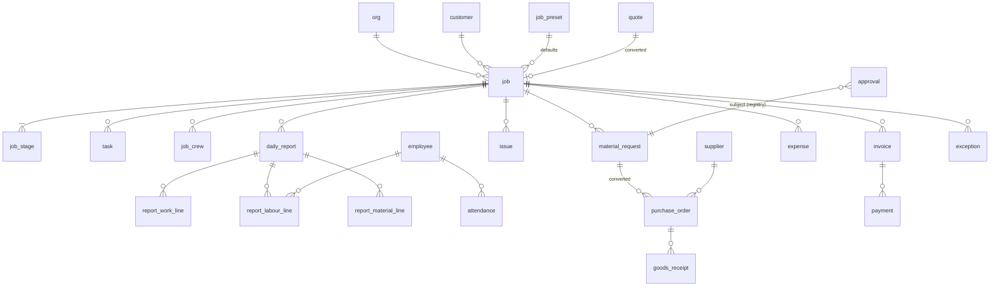

# 01 — Domain Model & ERD

**Purpose:** the MVP domain model, derived from a gap analysis of the actual Najolatech implementation (types.ts / migrations 0001–0056, extracted July 2026), generalised per the operations-first architecture (v2 §9–11). Everything here is specification; no migrations are written.

Package-wide constants apply (00-INDEX): org-scoped everything, UUIDv7 ids + separate human references, integer minor units, single org currency, `job` canonical name (U1).

> **Amended per audit (doc 12):** billing points (F-1), costing dedup + ex-VAT basis (F-2/F-53), `payment_receipt` rename (C-2), report stage-on-lines + `returned` state (C-5/C-6), stage reopen (F-5), `job_crew` replaces `assignment` (F-14), cuts — `week_plan`/`insight`/`branch`/date-ranged assignments (F-15/F-16/F-18), membership deactivation (F-7), credit notes (F-8), quote revisions & acceptance (F-9), notification preferences (F-12), holiday calendar (F-41), storage & retention appendices (F-35…F-39).

---

## Major decisions

**D-1.1 — Canonical object `job`, kind `project`.** Ratifies U1/v2 §8.4. Najolatech's `Project` maps to `job`; display name comes from terminology (doc 07). *Risk:* none new. *Pilot validation:* terminology layer makes "Boat"/"مشروع" feel native — no user should ever see the word "job" unless their template says so.

**D-1.2 — Users and employees are distinct entities, as in Najolatech.** `user` (login identity + membership + role) vs `employee` (labour resource with rates, trade, documents). A foreman is both (linked via `employee.user_id?`); most workers are employees only. **Why:** proven in production — labour costing, attendance, and HR documents must exist for people who never log in; conflating them couples licensing to workforce size (the per-seat trap of v1 research). **Alternatives rejected:** one `person` entity with optional auth (muddles authz and RLS); users-only with "ghost accounts" for workers (pays seat costs, pollutes membership). **Risks:** double entry when a worker becomes a user — mitigated by a link action, not a re-create. **Validate in pilots:** onboarding imports employees without inviting them; foremen link cleanly.

**D-1.3 — Money as integer minor units; VAT recorded per document, never assumed.** *(Amended 2026-07-11 by freeze log OP-8 closure — multi-currency documents):* supported currencies **AED, SAR, QAR, KWD, BHD, OMR, USD, EUR** with **currency-aware minor-unit exponents (KWD/BHD/OMR = 3, others = 2)** handled by the single formatting/parsing layer. Each org has one **base accounting currency**; `quote`, `invoice`, and `payment` carry `currency` + `exchange_rate` (to base, `numeric(18,8)`, set at issuance, immutable) + **frozen base-currency amounts** computed at issuance — costing, AR, reporting, and exceptions consume base amounts only and never recompute FX. Rates entered manually per document, defaulted from an org-editable rate table; no FX API, no gain/loss modelling in MVP (payment-vs-invoice FX differences surface as a note, not a ledger entry). Najolatech stores floats and recently had to fix VAT summaries to use actual recorded VAT per expense — both lessons adopted: bigint minor units end float drift; every money document carries explicit `vat_amount` (+ `vat_rate` as metadata), and summaries only ever sum recorded amounts. `is_export` zero-rating flag carried from the Najolatech invoice. **Alternatives rejected:** numeric floats (proven drift), assumed-rate VAT math (proven bug). **Risks:** conversion at display; standard formatting layer handles it. **Pilot validation:** accountant reconciles a pilot month to the fils/halala.

**D-1.4 — Derived-not-stored, with exactly two escape hatches: frozen snapshots and explicit overrides.** Progress, current stage, missing materials, stock availability, and all costing are computed from source records (Najolatech invariant set, adopted wholesale). The two production-proven exceptions carry over: **frozen cost snapshots** on report labour lines (historical costs must not change when salaries do) and **auditable overrides** (`progress_override`, delivery-gate override) where the derived value must yield to management judgment — always stamped who/when/why. **Alternatives rejected:** stored running totals (drift — see D-2.2's reconciliation alarm), no overrides (reality disagrees with formulas sometimes; Najolatech needed both). **Risks:** override abuse hiding real slippage — overrides surface as chips on Today, never silently.

**D-1.5 — The daily report keeps Najolatech's proven shape, with `certification` generalised to `review`.** Header (job, date, author, summary, blockers, next steps — **stage references live on work lines, not the header**, per audit C-5) + three line families: **work lines** (stage progress claims), **labour lines** (employee, normal/OT hours + frozen cost snapshot in a privileged side-table), **material lines** (item-linked or free-text, qty, unit, cost with `cost_source`, and deduction flags `deducted_from_inventory` / `cost_only` — the flags that let Najolatech operate with inventory locked are kept: **reports must never depend on inventory being live**). Unique (job, report_date, author). Review flow: `submitted → reviewed | returned` — a returned report reopens for the author to edit and resubmit (audit C-6); immutability applies after `reviewed` (doc 10). Per-line exception chips (doc 04 E-07); admin-only backfill preserved for history import. **Alternatives rejected:** free-form report + AI extraction (unvalidatable costing inputs); per-task micro-logging (too much friction for workshop reality — the daily rhythm is the proven grain). **Pilot validation:** report submission < 3 minutes on a phone; labour lines accepted as the attendance source (U3).

**D-1.6 — Denormalised display names on cost-bearing and audit-relevant rows, deliberately.** `item_name`, `customer_name`, `requested_by_name` snapshots survive catalog/party deletions — Najolatech's "resilience over purity" trade, kept because operational history must remain readable forever even when masters change. FK where live linkage matters; snapshot where history matters; both where both.

**D-1.7 — No hard deletes on operational or financial records: archive/void with reason.** Expenses/payments void (excluded from totals, visibly struck through); jobs archive; masters deactivate; deletion audit trail. Adopted verbatim from Najolatech 0048/0050 and consistent with v1 §12 lifecycle rules (the recycle-bin soft-delete applies to genuinely mistaken drafts only).

**D-1.8 — Two append-only streams: `activity` (operational narrative) and `audit_log` (security/config/financial mutations).** Activity is tenant-visible on every record ("who did what to this job"); audit is the v1 §12 compliance log (auth, permissions, money mutations, config revisions, support access) with stricter access and retention. One stream was rejected: mixing "stage completed" with "MFA reset" wrecks both audiences' signal and forces worst-case retention on everything. **Risk:** double-write misses — both writes happen in the service layer's single command path per mutation (one decorator, not per-feature discipline).

---

## Entity catalogue (by layer)

Key fields only; ✱ = admin/privileged side-table (two-tier sensitivity pattern); *(P3)* = designed now, built post-MVP.

**L1 Platform (v1 §11–12, unchanged shapes):** `org`, `company` (data-model-ready, single-company UI; **`branch` cut from MVP schema per audit F-18**), `user`, `membership` (user × org × role, with `deactivated_at` — deactivation reassigns open approvals by rule and flags active crew roles to the manager; historical FKs untouched, audit F-7), `role_assignment`, `entitlement_*` (doc 09), `audit_log`, `file` (org-prefixed storage, signed URLs with per-type access classes — Appendix A), `comment` (polymorphic, registry), `notification` + `notification_preference` (per-user channel prefs, audit F-12), `org_holiday_calendar` + Ramadan working-hours profile (template-seeded per country, org-editable — audit F-41), `app_settings` (working week **set at onboarding, country-aware defaults** — audit C-4; timezone, currency, `report_cutoff_time`, go-live cutoff dates — generalising Najolatech's `inventory_live_start_date` into a reusable *capability go-live cutoff* mechanism), `config_revision`.

**L2 Execution engine:**
- `job` — org, reference (template-patterned, unique/org — generalises hull number), `kind='project'`, name, customer_id?, `preset_id?` (→ job_preset), status (status_set ref + semantic category), current_stage_id (derived-denormalised), progress_override?, dates (start/due/completed), manager_id? (user), foreman_id? (user), selling_price_minor?, `price_adjustments[]` (audited amount+reason overrides, owner-only — the MVP scope-change mechanism, audit F-10), `billing_points [{trigger: on_acceptance | stage_key, pct}]` (seeded from preset, editable per job — drives E-09 and invoice prefill, audit F-1), payment_terms?, archived, `custom_values jsonb` (custom-field registry MVP = job, customer — audit F-13).
- `job_stage` — job, stage_key (from template), name-snapshot, weight, status (`not_started|in_progress|completed|skipped`), started/completed_at, notes; UNIQUE(job, stage_key). Completion transition carries an **optional guard slot** (P3: QC gate E-15) — designed now so P3 strengthens rather than changes the transition. **Reopen transition** `completed → in_progress` is a manager action with required reason, activity-logged; progress recomputes; reopening past a consumed billing point raises an exception, never claws back an invoice (audit F-5).
- `task` — job, stage?, title, status (`pending|in_progress|completed|cancelled`), assignee (employee), due_date.
- `job_crew` — job × employee membership (replaces date-ranged assignments per audit F-14; date-ranged scheduling is P4). Feeds the week view, `assigned_job` authz (via `employee.user_id`, doc 06), and foreman "my jobs".
- `daily_report` (+ `report_work_line`, `report_material_line`, `report_labour_line`✱ with frozen snapshots) — per D-1.5.
- `issue` — job?, title, severity (`low|medium|high|critical`), `is_blocker`, status (`open|in_progress|resolved|closed`), raised_by, assignee?, photos via files.
- `approval` + `approval_rule` — doc 05.
- ~~`week_plan`~~ — **cut from MVP** (audit F-15): the week *view* derives from jobs/stages/tasks/crew; the Najolatech planning-grid ritual returns at P3 if pilots miss it.
- `qc_template_item`, `qc_result` *(P3)* — adopting Najolatech's **planned-never-built** design (per-stage checklist items, optionally per preset; results pending/pass/fail/na; failure auto-raises linked `issue`; delivery gate = all pass/na unless audited override). Phase 2 note: this is the one part of the Najolatech spec with zero production validation — it gets a design review with pilot foremen before P3 build.
- `exception`, `digest` — doc 04. (~~`insight`~~ cut from MVP per audit F-16; returns with P3 pattern detection.)

**L3 Resources:**
- `employee` (+ `employee_terms`✱: monthly salary, hourly_cost default salary/208, ot_rate; + `employee_hr`✱: visa/ID/passport docs in private bucket, expiry dates → E-13) — Najolatech Worker/WorkerLabour/WorkerHr generalised, same privilege boundaries.
- `team` — kind `trade|line`, preset_id? (the "24ft team" pattern), sort_order.
- `attendance` — one row per employee/date, status (`present|absent|leave|half_day|sick|late`), marked_by; **in MVP auto-derived rows from report labour lines + manual grid for non-job staff** (U3).
- `supplier` — with `tax_reg_no` (generalises TRN), terms, active.
- `item` (catalog: sku, name, category from template category set, unit, unit_cost_minor?, selling_price_minor?, min_qty?), `stock_level`, `stock_allocation`, `stock_movement` (generic ledger: type `received|used|adjusted|returned|damaged`, typed reference) — *(P3; catalog itself ships in MVP because MRs/POs/report lines reference items — carrying Najolatech's proven "catalog live, stock deferred" mode via cost_only flags)*.
- `bom_item` *(P3)* — required/allocated/installed quantities; **missing derived, never stored** (= required − allocated − installed, floor 0, cancelled excluded — verbatim invariant).
- `asset` *(P4)*.

**L4 Commercial:**
- `customer` — name, country, contacts, tax_reg_no?, active.
- `quote` (+ lines with `section` grouping — Najolatech's quotation sections generalised into template config) — status `draft|pending_approval|approved|sent|accepted|rejected|expired|converted`, valid_until, discount_minor, vat, terms; **`revision_of_id?` (versioning) + `accepted_at / accepted_note / acceptance evidence file`** (audit F-9 — the record that justifies the acceptance-triggered billing point); `converted_job_id?`; conversion mapping: acceptance → job created from the quote's preset, quote total → job selling_price, terms → payment_terms, billing_points seeded from preset; `quote_template` per job_preset (the Build-a-Quote pattern, template-owned).
- `material_request` (+ lines) — status `draft|submitted|approved|rejected|converted`, urgency, job?, required_date; approval via doc 05.
- `purchase_order` (+ lines) — serial (org-configurable start — the "continues from paper LPO 27" requirement generalised), supplier, job?, status `draft|approved|sent|partially_received|received|cancelled`, vat_minor, pdf file.
- `goods_receipt` (+ lines: ordered/previously_received/received/damaged/rejected per PO line) — status flow as Najolatech GRN; movements post to stock ledger when Inventory live, else cost-only.
- `expense` — job? (null = overhead), date, category (template set), amount_minor + vat_amount_minor + total_minor, payment_status, void fields.
- `invoice` (+ lines) — serial, job?, customer snapshot + tax_reg_no, is_export, vat, **`kind = invoice | credit_note` + `corrects_invoice_id?`** (audit F-8 — cleared e-invoices are corrected by credit notes, never cancelled; AR math and the adapter contract include them), status `draft|issued|paid|partially_paid|cancelled` (cancel allowed pre-clearance only), amount_paid_minor (derived), **`einvoice_submission` satellite** (provider-agnostic: provider, payload ref, status, cleared_at, error — the D4 seam).
- `payment` — job/invoice?, date, amount_minor, method, reference, void fields — **the money-in record**. `payment_receipt` (renamed from `receipt` per audit C-2 to kill the goods-receipt collision) is its serial-numbered printable/approval wrapper; the draft→approve ritual is template-optional and **default off** pending PB-8 (approval, when on, confirms the payment; the payment row is created either way).
- `contract` *(P4, designed)* — Najolatech 0056 shape: serial, quote?, job?, buyer snapshot, milestone `schedule[{pct,label}]`, value, draft|signed, generated/signed PDFs.
- `pending_expense` + document-inbox flow *(P3: AI document extraction feeds review queue — Najolatech 0038 pattern)*.
- `customer_update` — MVP: AI-drafted, human-edited/sent progress summaries (doc 04), selected photos, **safe-by-construction** (no costs, workers as counts — Najolatech CustomerReport rule).

**L5 Config:** `template`, `terminology_map` (doc 07), `stage_template`, `status_set`, `field_definition` (+ values in `custom_values`), `approval_rule`, `exception_threshold_set`, `today_card_config`, `category_set` (item categories, expense categories, quote sections), **`job_preset`** — the generalisation of BoatModel: per-template named presets carrying default skipped stages, default quote template, reference-pattern piece, description (proven pattern: "product type as a bundle of defaults").

---

## ERD (core spine)

**Costing spine** (all rollups derived; single writer per D-2.2; **dedup rule per audit F-2, deterministic and validated at entry**):

1. **Acquisition channels are disjoint:** a purchase enters cost as a PO receipt **or** as an expense, never both — an `expense` may not reference a PO (validated at entry); PO-linked goods receipts cost the job directly at received value.
2. **Report material lines are evidence or cost, never ambiguously both:** lines referencing PO-supplied catalog items record *consumption* (`cost_source = po`) and are **excluded** from the cost sum; free-text/manual lines (`cost_source = manual`, incl. all `cost_only`-mode lines) are **included**.
3. **VAT basis (audit F-53):** for VAT-registered orgs, costs are **ex-VAT** (input VAT is recoverable and must not inflate cost/deflate margin); non-registered orgs cost VAT-inclusive. Org VAT registration is an onboarding fact. *Requires pilot-accountant sign-off (PB-3) before S5 golden files freeze.*
4. **Job cost = Σ included report material lines + Σ report_labour_line frozen costs✱ + Σ job expenses (per rule 1/3) + Σ PO receipts (per rule 1/3).** `quotedMinor` precedence: accepted quote total (+ audited price adjustments) → else `selling_price_minor` → else null; divergence between an accepted quote and a manually set selling price raises an exception, never silently picks (audit C-10).

Non-privileged view = cost excluding labour (Najolatech's `totalExLabour` rule, generalised to the cost-visibility permission, doc 06).

---

## Gap analysis — Najolatech → IdaraWorks (what changes and why)

| Najolatech (actual) | IdaraWorks | Change |
|---|---|---|
| `Project` + hullNumber, enginePackage, colorScheme, deliveryStatus | `job` + reference pattern; boat fields → template custom fields; deliveryStatus → status_set mapped to semantic categories | Boat-specific → config (v2 E2/E4) |
| `BoatModel` (9 seeded) + QuotationTemplate + default skips | `job_preset` + quote_template per preset | Proven pattern, promoted to platform concept |
| 11 stages, weights in constants.ts | `stage_template` rows in template #1, same weights | Code → config |
| Embedded `stages[]` on Project (TS model) | `job_stage` table | Normalised for RLS/query paths (DB plan already agreed) |
| Profile vs Worker split | `user` vs `employee` | Kept (D-1.2) |
| WorkerLabour / report_labour admin-only | `employee_terms`✱ / `report_labour_line`✱ + cost-visibility permission | Kept; generalised beyond "admin" |
| Floats in AED | bigint minor units | D-1.3 |
| `certificationStatus` pending/certified | report `review` status, reviewer configurable per template | Generalised |
| MR→LPO→GRN chain, partial receipts, serial from paper #27 | Same chain; org-configurable serial starts | Kept verbatim — production-proven |
| Draft→admin-approve scattered per feature | **Unified approval engine** (doc 05) | The single biggest structural upgrade |
| `alerts.ts` computed on page load, no storage | **Exception engine** (doc 04), materialized + lifecycle | Second biggest upgrade; alerts.ts's rule list seeds the E-catalogue |
| QC planned, never built | P3 capability from the planned design + pilot design review | Honest carry-forward of a gap |
| Inventory LOCKED, cost-only reports | `cost_only` flags are first-class; Inventory is P3 with an explicit **go-live cutoff mechanism** | The lock incident becomes a feature: capability go-live dates |
| us_partner region partition, ×1.20 | Out of scope for MVP; noted as future "external party with scoped pricing" pattern | Deliberate cut |
| Tally ledger, AI workforce chat | Not ported (tenant-specific history; AI chat lessons — pagination, tenancy — feed doc 04/v2 §14 instead) | Cut |
| Supabase 1,000-row cap lesson | Standing rule: every unbounded-table read pages (`selectAll` pattern); repeated in doc 10 checklist | Institutionalised |

**Unresolved item raised by this analysis → added to 00-INDEX as U7:** *stage weights vs task-based progress.* Najolatech proves weighted-stage progress works; v2 §10 mentioned task completion informing progress. Resolution taken: **stage weights are the progress model** (with in_progress = 0.5 heuristic and override); tasks are checklists that inform humans, not the progress math. Revisit only if pilots outside boatbuilding find stage-grain too coarse.

---

## Appendix A — Storage specification (adopted from audit F-34…F-38)

- **Ingest:** client-side resize/compress (max edge 2048 px, ~q75, target ≤ 500 KB) → server re-encode → **EXIF/GPS strip** (workshop photos carry employee geolocation PII) → queue-generated derivatives: thumbnail (~200 px) + medium (~1280 px). Offline outbox stores compressed blobs. Originals retained only for `financial_doc` / `hr_doc` classes.
- **Access classes per `attached_to` type**, enforced at signed-URL minting: `job_media` (job-visibility roles) · `financial_doc` (requires `finance.viewPrices`) · `hr_doc` (privileged bucket) · `customer_share` (watermarked derivative behind the doc 04 share-token surface). Signed URLs 60–300 s app-use; ≤ 1 h for cacheable thumbnails. Today photo strips render **thumbnails only**.
- **Quota:** transactional per-org byte counter on insert/void, nightly reconcile vs bucket listing; enforcement at signed-*upload*-URL issuance (warn 80 %, block adds at 100 %, never reads/exports).
- **Lifecycle:** files obey D-1.7 void semantics; **legal hold suspends storage deletion**; account-closure purge enumerates and verifies object deletion; recycle-bin restore restores objects.
- **Backup:** nightly incremental bucket replication to a second provider + manifest; storage restore is part of the quarterly drill.
- **Cost:** cache-control on derivatives; per-org monthly egress metric on the telemetry dashboard.

## Appendix B — Retention policies (adopted from audit F-39)

| Stream | Policy |
|---|---|
| `domain_event` bus | purge processed > 30–90 days (transport, not record) |
| `notification` | delete read > 90 d; unread > 12 mo |
| `exception` | 24 mo (open + resolved), then monthly aggregates per rule |
| `activity` | kept (tenant promise); monthly partitions; cold storage > 3 yr; in the export set |
| `audit_log` | per tier, **but financial-mutation rows ≥ 6 years regardless of tier** (KSA ≥ 6 yr / UAE ≥ 5 yr VAT records) |
| `ai_interaction_log` | 90 d raw prompts/outputs; 12 mo metadata |
| `digest` | 90 d full payloads; headlines thereafter |
